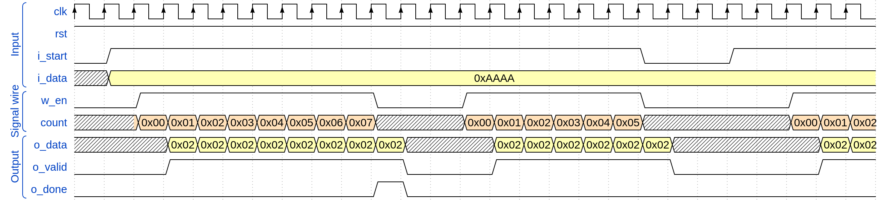
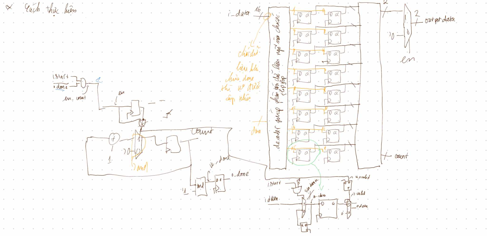
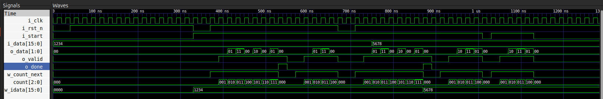

# The Waveform ideal

<!-- ```wavedorm
    { signal:[
    [ 'Input',
        { name: 'clk',      wave: 'P..P..P....................'},
        { name: 'rst',      wave: '1..........................'},
        { name: 'i_start',  wave: '01.................0..1....'},
        { name: 'i_data',   wave: 'x3.........................', data: ['0xAAAA']}
    ],
    [ 'Signal wire',
        { name: 'w_en',     wave: '0.1.......0..1.....0....1..'},
        { name: 'count',    wave: '.444444444xxx444444xxxxx444', data: ['0x00', '0x01', '0x02', '0x03', '0x04', '0x05', '0x06', '0x07', '0x00', '0x01', '0x02', '0x03', '0x04', '0x05', '0x00', '0x01', '0x02', '0x03', '0x04', '0x05', '0x06', '0x07']}
    ],
    [ 'Output',
        { name: 'o_data',   wave: 'x..33333333xxx333333xxxxx33', data: ['0x02', '0x02', '0x02', '0x02', '0x02', '0x02', '0x02', '0x02', '0x02', '0x02', '0x02', '0x02', '0x02', '0x02', '0x02', '0x02' ]},
        { name: 'o_valid',  wave: '0..1.......0..1.....0....1.'},
        { name: 'o_done',  wave: '0..........10..............'}
    ]
]}
``` -->



# Block Diagram



# Test bench

```verilog
  // Task to display signals
  task display_signals;
      $display("Time = %t \t| i_start = %b \t| i_data = %b \t| o_data = %b \t| o_valid = %b \t| o_done = %b",
               $time, i_start, i_data, o_data, o_valid, o_done);
  endtask

  // Task to run a test case with given inputs
  task run_test_case(input string test_name, logic rst_n, logic start, logic [SIZE_DATA_IN-1:0] data, integer cycles);
      $display("========== %s =========", test_name);
      i_rst_n = rst_n;
      i_start = start;
      i_data = data;
      #20; // Wait for signal stabilization
      if (!rst_n) begin
          #20;
          i_rst_n = 1'b1; // Release reset if needed
      end
      repeat (cycles) begin
          @(posedge i_clk);
          display_signals();
          if (o_done) begin
              $display("Done processing data.");
              @(posedge i_clk);
              break; // Exit loop when done
          end
      end
  endtask
```

- Test case 1: Reset and Start

```verilog
      run_test_case("Test Case 1: Reset and Start", 1'b0, 1'b0, 16'h1234, 10);
```

**Purpose**: Check signals during reset and initialization.

- Test case 2:

```verilog
    run_test_case("Test Case 2: Test Output After Reset", 1'b0, 1'b1, 16'h1234, 10);
```

**Purpose**: Verify the basic PISO function of serial output after reset.

- Test case 3: Change Data When Start is High

```verilog
    run_test_case("Test Case 3: Change Data When Start is High - Data = 0x1234", 1'b0, 1'b1, 16'h1234, 2);
    run_test_case("Test Case 3: Change Data When Start is High - Data = 0x5678", 1'b1, 1'b1, 16'h5678, 8);
```

**Purpose**: Test if the PISO continues processing correctly when input data changes during operation.

- Test Case 4: Change Start Signal While Data is Being Processed

```verilog
    $display("========== Test Case 4: Change Start Signal While Data is Being Processed =========");
    i_start = 1'b0;
    #20;
    i_start = 1'b1;
    i_data = 16'h5678;
    repeat (5) begin
        @(posedge i_clk);
        display_signals();
        if (o_done) begin
            $display("Done processing new data.");
            @(posedge i_clk);
            break;
        end
    end
    i_start = 1'b0;
    repeat (5) begin
        @(posedge i_clk);
        display_signals();
        if (o_done) begin
            $display("Done processing new data.");
            @(posedge i_clk);
            break;
        end
    end
```

**Purpose**: Validate behavior when *i_start* is toggled during data processing.

# The result

```bash
    ========== Test Case 1: Reset and Start =========
Time =                50000 	| i_start = 0 	| i_data = 0001001000110100 	| o_data = 00 	| o_valid = 0 	| o_done = 0
Time =                70000 	| i_start = 0 	| i_data = 0001001000110100 	| o_data = 00 	| o_valid = 0 	| o_done = 0
Time =                90000 	| i_start = 0 	| i_data = 0001001000110100 	| o_data = 00 	| o_valid = 0 	| o_done = 0
Time =               110000 	| i_start = 0 	| i_data = 0001001000110100 	| o_data = 00 	| o_valid = 0 	| o_done = 0
Time =               130000 	| i_start = 0 	| i_data = 0001001000110100 	| o_data = 00 	| o_valid = 0 	| o_done = 0
Time =               150000 	| i_start = 0 	| i_data = 0001001000110100 	| o_data = 00 	| o_valid = 0 	| o_done = 0
Time =               170000 	| i_start = 0 	| i_data = 0001001000110100 	| o_data = 00 	| o_valid = 0 	| o_done = 0
Time =               190000 	| i_start = 0 	| i_data = 0001001000110100 	| o_data = 00 	| o_valid = 0 	| o_done = 0
Time =               210000 	| i_start = 0 	| i_data = 0001001000110100 	| o_data = 00 	| o_valid = 0 	| o_done = 0
Time =               230000 	| i_start = 0 	| i_data = 0001001000110100 	| o_data = 00 	| o_valid = 0 	| o_done = 0
========== Test Case 2: Test Output After Reset =========
Time =               390000 	| i_start = 1 	| i_data = 0001001000110100 	| o_data = 00 	| o_valid = 0 	| o_done = 0
Time =               410000 	| i_start = 1 	| i_data = 0001001000110100 	| o_data = 00 	| o_valid = 1 	| o_done = 0
Time =               430000 	| i_start = 1 	| i_data = 0001001000110100 	| o_data = 01 	| o_valid = 1 	| o_done = 0
Time =               450000 	| i_start = 1 	| i_data = 0001001000110100 	| o_data = 11 	| o_valid = 1 	| o_done = 0
Time =               470000 	| i_start = 1 	| i_data = 0001001000110100 	| o_data = 00 	| o_valid = 1 	| o_done = 0
Time =               490000 	| i_start = 1 	| i_data = 0001001000110100 	| o_data = 10 	| o_valid = 1 	| o_done = 0
Time =               510000 	| i_start = 1 	| i_data = 0001001000110100 	| o_data = 00 	| o_valid = 1 	| o_done = 0
Time =               530000 	| i_start = 1 	| i_data = 0001001000110100 	| o_data = 01 	| o_valid = 1 	| o_done = 0
Time =               550000 	| i_start = 1 	| i_data = 0001001000110100 	| o_data = 00 	| o_valid = 1 	| o_done = 1
Done processing data.
========== Test Case 3: Change Data When Start is High - Data = 0x1234 =========
Time =               730000 	| i_start = 1 	| i_data = 0001001000110100 	| o_data = 00 	| o_valid = 0 	| o_done = 0
Time =               750000 	| i_start = 1 	| i_data = 0001001000110100 	| o_data = 00 	| o_valid = 1 	| o_done = 0
========== Test Case 3: Change Data When Start is High - Data = 0x5678 =========
Time =               790000 	| i_start = 1 	| i_data = 0101011001111000 	| o_data = 11 	| o_valid = 1 	| o_done = 0
Time =               810000 	| i_start = 1 	| i_data = 0101011001111000 	| o_data = 00 	| o_valid = 1 	| o_done = 0
Time =               830000 	| i_start = 1 	| i_data = 0101011001111000 	| o_data = 10 	| o_valid = 1 	| o_done = 0
Time =               850000 	| i_start = 1 	| i_data = 0101011001111000 	| o_data = 00 	| o_valid = 1 	| o_done = 0
Time =               870000 	| i_start = 1 	| i_data = 0101011001111000 	| o_data = 01 	| o_valid = 1 	| o_done = 0
Time =               890000 	| i_start = 1 	| i_data = 0101011001111000 	| o_data = 00 	| o_valid = 1 	| o_done = 1
Done processing data.
========== Test Case 4: Change Start Signal While Data is Being Processed =========
Time =              1050000 	| i_start = 1 	| i_data = 0101011001111000 	| o_data = 00 	| o_valid = 0 	| o_done = 0
Time =              1070000 	| i_start = 1 	| i_data = 0101011001111000 	| o_data = 00 	| o_valid = 1 	| o_done = 0
Time =              1090000 	| i_start = 1 	| i_data = 0101011001111000 	| o_data = 10 	| o_valid = 1 	| o_done = 0
Time =              1110000 	| i_start = 1 	| i_data = 0101011001111000 	| o_data = 11 	| o_valid = 1 	| o_done = 0
Time =              1130000 	| i_start = 1 	| i_data = 0101011001111000 	| o_data = 01 	| o_valid = 1 	| o_done = 0
Time =              1150000 	| i_start = 0 	| i_data = 0101011001111000 	| o_data = 00 	| o_valid = 0 	| o_done = 0
Time =              1170000 	| i_start = 0 	| i_data = 0101011001111000 	| o_data = 00 	| o_valid = 0 	| o_done = 0
Time =              1190000 	| i_start = 0 	| i_data = 0101011001111000 	| o_data = 00 	| o_valid = 0 	| o_done = 0
Time =              1210000 	| i_start = 0 	| i_data = 0101011001111000 	| o_data = 00 	| o_valid = 0 	| o_done = 0
Time =              1230000 	| i_start = 0 	| i_data = 0101011001111000 	| o_data = 00 	| o_valid = 0 	| o_done = 0
Simulation completed.
- tb_PISO.sv:212: Verilog $finish

```

# The Waveform after testbench


