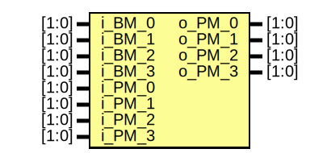

# Viterbi_decoder
## 00_spec

1. Branch Metric Unit (BMU): Thực hiện chức năng tính toán **Hamming distance** với dữ liệu ngõ vào là 2bit. thực hiện với bảng chân trị sau:

| i_data | o_BM_0 | o_BM_1 | o_BM_2 | o_BM_3|
|-------|-------|-------|-------|-------|
| 00 | 00 | 01 | 01 | 10 |
| 01 | 01 | 00 | 10 | 01 |
| 10 | 01 | 10 | 00 | 01 |
| 11 | 10 | 01 | 01 | 00 |


2. Add Compare Select Unit (ACSU): Thực hiện việc cộng tính toán các dữ liệu **Branch Metric** và **Path Metric** đầu vào tại các thời điểm cụ thể.


- Add unit: thực hiện việc cộng theo bảng sau:

| A  | B  | S  |
| -- | -- | -- |
| 00 | 00 | 00 |
| 00 | 01 | 01 |
| 00 | 10 | 10 |
| 00 | 11 | 11 |
| 01 | 00 | 01 |
| 01 | 01 | 10 |
| 01 | 10 | 11 |
| 01 | 11 | 11 |
| 10 | 00 | 10 |
| 10 | 01 | 11 |
| 10 | 10 | 11 |
| 10 | 11 | 11 |
| 11 | 00 | 11 |
| 11 | 01 | 11 |
| 11 | 10 | 11 |
| 11 | 11 | 11 |

- Compare unit: thực hiện việc so sanh theo bẳng sau:

| A  | B  | C  |
| -- | -- | -- |
| 00 | 00 |  1 |
| 00 | 01 |  1 |
| 00 | 10 |  1 |
| 00 | 11 |  1 |
| 01 | 00 |  0 |
| 01 | 01 |  1 |
| 01 | 10 |  1 |
| 01 | 11 |  1 |
| 10 | 00 |  0 |
| 10 | 01 |  0 |
| 10 | 10 |  1 |
| 10 | 11 |  1 |
| 11 | 00 |  0 |
| 11 | 01 |  0 |
| 11 | 10 |  0 |
| 11 | 11 |  1 |

- Select Unit: chọn giá trị ngõ ra.

| A | B | Compare_less | S | 
|---|---|--------------|---|
| Data_A | x | 0 | Data_A |
| x |Data_B | 1 | Datâ_B |

3. Path Metric Unit (PMU): Thực hiện việc lưu giá trị của **Path Metric** trước đó để sử dụng cho chu kỳ tiếp theo.

4. Survivor Path Memory Unit (SPMU): Thực hiện việc kiểm tra, xử lý dữ liệu sau khi giải mã.


## 01_system_lever_test

```C
void Input_data_string(char *input_data, int *length_input_data);
void Trans_string_to_binary(char *i_input_data, int *o_input_buf, int i_length_input_data, int *o_length_input_buf);
void Block_input_data(int *o_input_buf, int *o_length_input_buf);
void Block_convolutional_codes(int *i_input_buf, int i_length_input_buf, int *o_conv_buf, int *o_length_conv_buf);
void Block_viterbi_decod(int *o_input_buf, int *o_length_input_buf);
void HD(int i_data[N], int i_exp[N], int *o_HD);
void BMU(int i_data[N], int o_branch_metric[STATE]);
void ACSU(int i_branch_metric[STATE], int i_path_metric[STATE], int o_path_metric[STATE]);
void PMU(int i_path_metric[STATE], int o_path_metric[STATE]);
void SPMU(int i_path_metric[STATE], int *o_decision_bit);
```

```bash

------------------- Input Data -------------------
Input data: 110110
The constraint length K = 3
The number of input M = 1
The number of output N = 2
Enter the Generator Polynomial Matrix (G[n][k]): = [(1 1 1) (1 0 1)]

Input data: 110110

------------- Ouput Conv Data -------------

Conv Data: 110101000101


------------------- Input Data -------------------
Input data: 110110
The constraint length K = 3
The number of input M = 1
The number of output N = 2
Enter the Generator Polynomial Matrix (G[n][k]): = [(1 1 1) (1 0 1)]

Input data: 110110

------------- Ouput Conv Data -------------

Conv Data: 110101000101

------------- Viterbi Decoder -------------
Viterbi data: 110101000101

Input Viterbi: 11
 BM0 = 2, BM1 = 1, BM2 = 1, BM3 = 0
 iPM0 = 0, iPM1 = 3, iPM2 = 3, iPM3 = 3
 oPM0 = 2, oPM1 = 4, oPM2 = 0, oPM3 = 4
State = 1
Nex State = 3
Decision Bit = 1
Input Viterbi: 10
 BM0 = 1, BM1 = 0, BM2 = 2, BM3 = 1
 iPM0 = 2, iPM1 = 4, iPM2 = 0, iPM3 = 4
 oPM0 = 3, oPM1 = 2, oPM2 = 3, oPM3 = 0
State = 3
Nex State = 4
Decision Bit = 1
Input Viterbi: 10
 BM0 = 1, BM1 = 0, BM2 = 2, BM3 = 1
 iPM0 = 3, iPM1 = 2, iPM2 = 3, iPM3 = 0
 oPM0 = 3, oPM1 = 0, oPM2 = 3, oPM3 = 2
State = 4
Nex State = 2
Decision Bit = 0
Input Viterbi: 00
 BM0 = 0, BM1 = 1, BM2 = 1, BM3 = 2
 iPM0 = 3, iPM1 = 0, iPM2 = 3, iPM3 = 2
 oPM0 = 2, oPM1 = 3, oPM2 = 0, oPM3 = 3
State = 2
Nex State = 3
Decision Bit = 1
Input Viterbi: 10
 BM0 = 1, BM1 = 0, BM2 = 2, BM3 = 1
 iPM0 = 2, iPM1 = 3, iPM2 = 0, iPM3 = 3
 oPM0 = 3, oPM1 = 2, oPM2 = 3, oPM3 = 0
State = 3
Nex State = 4
Decision Bit = 1
Input Viterbi: 10
 BM0 = 1, BM1 = 0, BM2 = 2, BM3 = 1
 iPM0 = 3, iPM1 = 2, iPM2 = 3, iPM3 = 0
 oPM0 = 3, oPM1 = 0, oPM2 = 3, oPM3 = 2
State = 4
Nex State = 2
Decision Bit = 0
Viterbi Data: 110110


❯ make all
./VD_312 

------------------- Input Data -------------------
Input data: 110110
The constraint length K = 3
The number of input M = 1
The number of output N = 2
Enter the Generator Polynomial Matrix (G[n][k]): = [(1 1 1) (1 0 1)]

Input data: 110110

------------- Ouput Conv Data -------------

Conv Data: 110101000101

------------- Viterbi Decoder -------------
Viterbi data: 110111000101

Input Viterbi: 11
 BM0 = 2, BM1 = 1, BM2 = 1, BM3 = 0
 iPM0 = 0, iPM1 = 3, iPM2 = 3, iPM3 = 3
 oPM0 = 2, oPM1 = 4, oPM2 = 0, oPM3 = 4
State = 1
Nex State = 3
Decision Bit = 1
Input Viterbi: 10
 BM0 = 1, BM1 = 0, BM2 = 2, BM3 = 1
 iPM0 = 2, iPM1 = 4, iPM2 = 0, iPM3 = 4
 oPM0 = 3, oPM1 = 2, oPM2 = 3, oPM3 = 0
State = 3
Nex State = 4
Decision Bit = 1
Input Viterbi: 11
 BM0 = 2, BM1 = 1, BM2 = 1, BM3 = 0
 iPM0 = 3, iPM1 = 2, iPM2 = 3, iPM3 = 0
 oPM0 = 2, oPM1 = 1, oPM2 = 3, oPM3 = 1
State = 4
Nex State = 2
Decision Bit = 0
Input Viterbi: 00
 BM0 = 0, BM1 = 1, BM2 = 1, BM3 = 2
 iPM0 = 2, iPM1 = 1, iPM2 = 3, iPM3 = 1
 oPM0 = 2, oPM1 = 2, oPM2 = 1, oPM3 = 2
State = 2
Nex State = 3
Decision Bit = 1
Input Viterbi: 10
 BM0 = 1, BM1 = 0, BM2 = 2, BM3 = 1
 iPM0 = 2, iPM1 = 2, iPM2 = 1, iPM3 = 2
 oPM0 = 3, oPM1 = 2, oPM2 = 3, oPM3 = 1
State = 3
Nex State = 4
Decision Bit = 1
Input Viterbi: 10
 BM0 = 1, BM1 = 0, BM2 = 2, BM3 = 1
 iPM0 = 3, iPM1 = 2, iPM2 = 3, iPM3 = 1
 oPM0 = 3, oPM1 = 1, oPM2 = 3, oPM3 = 3
State = 4
Nex State = 2
Decision Bit = 0
Viterbi Data: 110110


❯ make all
./VD_312 

------------------- Input Data -------------------
Input data: 110110
The constraint length K = 3
The number of input M = 1
The number of output N = 2
Enter the Generator Polynomial Matrix (G[n][k]): = [(1 1 1) (1 0 1)]

Input data: 110110

------------- Ouput Conv Data -------------

Conv Data: 110101000101

------------- Viterbi Decoder -------------
Viterbi data: 110111000111

Input Viterbi: 11
 BM0 = 2, BM1 = 1, BM2 = 1, BM3 = 0
 iPM0 = 0, iPM1 = 3, iPM2 = 3, iPM3 = 3
 oPM0 = 2, oPM1 = 4, oPM2 = 0, oPM3 = 4
State = 1
Nex State = 3
Decision Bit = 1
Input Viterbi: 10
 BM0 = 1, BM1 = 0, BM2 = 2, BM3 = 1
 iPM0 = 2, iPM1 = 4, iPM2 = 0, iPM3 = 4
 oPM0 = 3, oPM1 = 2, oPM2 = 3, oPM3 = 0
State = 3
Nex State = 4
Decision Bit = 1
Input Viterbi: 11
 BM0 = 2, BM1 = 1, BM2 = 1, BM3 = 0
 iPM0 = 3, iPM1 = 2, iPM2 = 3, iPM3 = 0
 oPM0 = 2, oPM1 = 1, oPM2 = 3, oPM3 = 1
State = 4
Nex State = 2
Decision Bit = 0
Input Viterbi: 00
 BM0 = 0, BM1 = 1, BM2 = 1, BM3 = 2
 iPM0 = 2, iPM1 = 1, iPM2 = 3, iPM3 = 1
 oPM0 = 2, oPM1 = 2, oPM2 = 1, oPM3 = 2
State = 2
Nex State = 3
Decision Bit = 1
Input Viterbi: 10
 BM0 = 1, BM1 = 0, BM2 = 2, BM3 = 1
 iPM0 = 2, iPM1 = 2, iPM2 = 1, iPM3 = 2
 oPM0 = 3, oPM1 = 2, oPM2 = 3, oPM3 = 1
State = 3
Nex State = 4
Decision Bit = 1
Input Viterbi: 11
 BM0 = 2, BM1 = 1, BM2 = 1, BM3 = 0
 iPM0 = 3, iPM1 = 2, iPM2 = 3, iPM3 = 1
 oPM0 = 2, oPM1 = 2, oPM2 = 3, oPM3 = 2
State = 4
Nex State = 2
Decision Bit = 0
Viterbi Data: 110110
```

## 02_rtl

- Full_adder


- Hamming_distance


- Branch_metric_unit


- Add_unit


- ACS


- Compare_unit


- Add_compare_select_unit


- Path_metric_unit


- Survivor_path_memory_unit


## 03_verif

1. Branch Metric Unit

```bash
Test case 1: 0x00
| Time =                10000 	|
| w_idata = 00 	|
| w_BM_0 = 00 	| w_BM_1 = 01 	| w_BM_2 = 01 	| w_BM_3 = 10 	|
-> PASS
--------------------------------------------------
Test case 2: 0x01
| Time =                20000 	|
| w_idata = 01 	|
| w_BM_0 = 01 	| w_BM_1 = 00 	| w_BM_2 = 10 	| w_BM_3 = 01 	|
-> PASS
--------------------------------------------------
Test case 3: 0x10
| Time =                30000 	|
| w_idata = 10 	|
| w_BM_0 = 01 	| w_BM_1 = 10 	| w_BM_2 = 00 	| w_BM_3 = 01 	|
-> PASS
--------------------------------------------------
Test case 4: 0x11
| Time =                40000 	|
| w_idata = 11 	|
| w_BM_0 = 10 	| w_BM_1 = 01 	| w_BM_2 = 01 	| w_BM_3 = 00 	|
-> PASS
--------------------------------------------------
```

2. Add Compare Select Unit

- Add Unit

```bash
Starting Add_unit testbench...
============================
Test case 1 	| Inputs: 00 + 00 	| Output: 00 	| Expected: 00 	| -> PASS
Test case 2 	| Inputs: 00 + 01 	| Output: 01 	| Expected: 01 	| -> PASS
Test case 3 	| Inputs: 00 + 10 	| Output: 10 	| Expected: 10 	| -> PASS
Test case 4 	| Inputs: 00 + 11 	| Output: 11 	| Expected: 11 	| -> PASS
Test case 5 	| Inputs: 01 + 00 	| Output: 01 	| Expected: 01 	| -> PASS
Test case 6 	| Inputs: 01 + 01 	| Output: 10 	| Expected: 10 	| -> PASS
Test case 7 	| Inputs: 01 + 10 	| Output: 11 	| Expected: 11 	| -> PASS
Test case 8 	| Inputs: 01 + 11 	| Output: 11 	| Expected: 11 	| -> PASS
Test case 9 	| Inputs: 10 + 00 	| Output: 10 	| Expected: 10 	| -> PASS
Test case 10 	| Inputs: 10 + 01 	| Output: 11 	| Expected: 11 	| -> PASS
Test case 11 	| Inputs: 10 + 10 	| Output: 11 	| Expected: 11 	| -> PASS
Test case 12 	| Inputs: 10 + 11 	| Output: 11 	| Expected: 11 	| -> PASS
Test case 13 	| Inputs: 11 + 00 	| Output: 11 	| Expected: 11 	| -> PASS
Test case 14 	| Inputs: 11 + 01 	| Output: 11 	| Expected: 11 	| -> PASS
Test case 15 	| Inputs: 11 + 10 	| Output: 11 	| Expected: 11 	| -> PASS
Test case 16 	| Inputs: 11 + 11 	| Output: 11 	| Expected: 11 	| -> PASS

Test Summary:
=============
Total tests : 16
Passed      : 16
Failed      : 0
Pass rate   : 100.00%
- tb_addunit.sv:173: Verilog $finish
```

- Compare Unit

```bash
Starting Compare_unit testbench...
=================================
Test case 1 	| Inputs: A=00 	 B=00 	| Output: 1 	| Expected: 1 	| -> PASS
Test case 2 	| Inputs: A=00 	 B=01 	| Output: 1 	| Expected: 1 	| -> PASS
Test case 3 	| Inputs: A=00 	 B=10 	| Output: 1 	| Expected: 1 	| -> PASS
Test case 4 	| Inputs: A=00 	 B=11 	| Output: 1 	| Expected: 1 	| -> PASS
Test case 5 	| Inputs: A=01 	 B=00 	| Output: 0 	| Expected: 0 	| -> PASS
Test case 6 	| Inputs: A=01 	 B=01 	| Output: 1 	| Expected: 1 	| -> PASS
Test case 7 	| Inputs: A=01 	 B=10 	| Output: 1 	| Expected: 1 	| -> PASS
Test case 8 	| Inputs: A=01 	 B=11 	| Output: 1 	| Expected: 1 	| -> PASS
Test case 9 	| Inputs: A=10 	 B=00 	| Output: 0 	| Expected: 0 	| -> PASS
Test case 10 	| Inputs: A=10 	 B=01 	| Output: 0 	| Expected: 0 	| -> PASS
Test case 11 	| Inputs: A=10 	 B=10 	| Output: 1 	| Expected: 1 	| -> PASS
Test case 12 	| Inputs: A=10 	 B=11 	| Output: 1 	| Expected: 1 	| -> PASS
Test case 13 	| Inputs: A=11 	 B=00 	| Output: 0 	| Expected: 0 	| -> PASS
Test case 14 	| Inputs: A=11 	 B=01 	| Output: 0 	| Expected: 0 	| -> PASS
Test case 15 	| Inputs: A=11 	 B=10 	| Output: 0 	| Expected: 0 	| -> PASS
Test case 16 	| Inputs: A=11 	 B=11 	| Output: 1 	| Expected: 1 	| -> PASS

Test Summary:
=============
Total tests : 16
Passed      : 16
Failed      : 0
Pass rate   : 100.00%
- tb_compare.sv:151: Verilog $finish
```

- ACSU

```bash
Time: 110000 	| i_data = 00 	| i_valid = 0 	|
| i_BM_0: 00 	| i_BM_1: 01 	| i_BM_2: 01 	| i_BM_3: 10 	|
| i_PM_0: 00 	| i_PM_1: 11 	| i_PM_2: 11 	| i_PM_3: 11 	|
| o_PM_0: 00 	| o_PM_1: 11 	| o_PM_2: 10 	| o_PM_3: 11 	|
| t_PM_0: 00 	| t_PM_1: 11 	| t_PM_2: 10 	| t_PM_3: 11 	|
-> PASS
=====================================
Starting ACSU and PMU testbench...
Time: 130000 	| i_data = 00 	| i_valid = 1 	|
| i_BM_0: 00 	| i_BM_1: 01 	| i_BM_2: 01 	| i_BM_3: 10 	|
| i_PM_0: 00 	| i_PM_1: 11 	| i_PM_2: 11 	| i_PM_3: 11 	|
| o_PM_0: 00 	| o_PM_1: 11 	| o_PM_2: 10 	| o_PM_3: 11 	|
| t_PM_0: 00 	| t_PM_1: 11 	| t_PM_2: 10 	| t_PM_3: 11 	|
-> PASS
=====================================
=====================================
Time: 150000 	| i_data = 00 	| i_valid = 1 	|
| i_BM_0: 00 	| i_BM_1: 01 	| i_BM_2: 01 	| i_BM_3: 10 	|
| i_PM_0: 00 	| i_PM_1: 11 	| i_PM_2: 10 	| i_PM_3: 11 	|
| o_PM_0: 00 	| o_PM_1: 11 	| o_PM_2: 10 	| o_PM_3: 11 	|
| t_PM_0: 00 	| t_PM_1: 11 	| t_PM_2: 10 	| t_PM_3: 11 	|
-> PASS
=====================================
=====================================
Time: 170000 	| i_data = 01 	| i_valid = 1 	|
| i_BM_0: 01 	| i_BM_1: 00 	| i_BM_2: 10 	| i_BM_3: 01 	|
| i_PM_0: 00 	| i_PM_1: 11 	| i_PM_2: 10 	| i_PM_3: 11 	|
| o_PM_0: 10 	| o_PM_1: 10 	| o_PM_2: 10 	| o_PM_3: 01 	|
| t_PM_0: 10 	| t_PM_1: 10 	| t_PM_2: 10 	| t_PM_3: 01 	|
-> PASS
=====================================
=====================================
Time: 190000 	| i_data = 10 	| i_valid = 1 	|
| i_BM_0: 01 	| i_BM_1: 10 	| i_BM_2: 00 	| i_BM_3: 01 	|
| i_PM_0: 01 	| i_PM_1: 11 	| i_PM_2: 01 	| i_PM_3: 10 	|
| o_PM_0: 10 	| o_PM_1: 10 	| o_PM_2: 10 	| o_PM_3: 10 	|
| t_PM_0: 10 	| t_PM_1: 10 	| t_PM_2: 10 	| t_PM_3: 10 	|
-> PASS
=====================================
=====================================
Time: 210000 	| i_data = 11 	| i_valid = 1 	|
| i_BM_0: 10 	| i_BM_1: 01 	| i_BM_2: 01 	| i_BM_3: 00 	|
| i_PM_0: 10 	| i_PM_1: 01 	| i_PM_2: 10 	| i_PM_3: 10 	|
| o_PM_0: 11 	| o_PM_1: 11 	| o_PM_2: 01 	| o_PM_3: 11 	|
| t_PM_0: 11 	| t_PM_1: 11 	| t_PM_2: 01 	| t_PM_3: 11 	|
-> PASS
=====================================
=====================================
Simulation finished.
=====================================
- tb_acsu.sv:359: Verilog $finish
```

3. Survivor Path Memory Unit

```bash
Time =                 5000 	| i_rst_n = 1 	| i_valid = 0 	| o_decision = 0 	|
PM_0 = 00 	| PM_1 = 00 	| PM_2 = 00 	| PM_3 = 00 	|
=========================================
case 1: S0 -> S0
Time =                16000 	| i_rst_n = 1 	| i_valid = 1 	| o_decision = 0 	|
PM_0 = 00 	| PM_1 = 01 	| PM_2 = 10 	| PM_3 = 11 	|
-> PASS
=========================================
case 2: S0 -> S2
Time =                26000 	| i_rst_n = 1 	| i_valid = 1 	| o_decision = 1 	|
PM_0 = 11 	| PM_1 = 10 	| PM_2 = 01 	| PM_3 = 00 	|
-> PASS
=========================================
case 3: S2 -> S1
Time =                36000 	| i_rst_n = 1 	| i_valid = 1 	| o_decision = 0 	|
PM_0 = 10 	| PM_1 = 00 	| PM_2 = 00 	| PM_3 = 01 	|
-> PASS
=========================================
case 4: S1 -> S2
Time =                46000 	| i_rst_n = 1 	| i_valid = 1 	| o_decision = 1 	|
PM_0 = 11 	| PM_1 = 00 	| PM_2 = 01 	| PM_3 = 10 	|
-> PASS
=========================================
case 5: S2 -> S3
Time =                56000 	| i_rst_n = 1 	| i_valid = 1 	| o_decision = 1 	|
PM_0 = 01 	| PM_1 = 10 	| PM_2 = 11 	| PM_3 = 00 	|
-> PASS
=========================================
case 6: S3 -> S3
Time =                66000 	| i_rst_n = 1 	| i_valid = 1 	| o_decision = 1 	|
PM_0 = 11 	| PM_1 = 10 	| PM_2 = 01 	| PM_3 = 00 	|
-> PASS
=========================================
case 7: S3 -> S1
Time =                76000 	| i_rst_n = 1 	| i_valid = 1 	| o_decision = 0 	|
PM_0 = 11 	| PM_1 = 00 	| PM_2 = 01 	| PM_3 = 10 	|
-> PASS
=========================================
case 8: S1 -> S0
Time =                86000 	| i_rst_n = 1 	| i_valid = 1 	| o_decision = 0 	|
PM_0 = 00 	| PM_1 = 01 	| PM_2 = 01 	| PM_3 = 10 	|
-> PASS
=========================================
Testbench completed successfully
==================================
- tb_spmu.sv:168: Verilog $finish
```

## 04_imple

## 20_doc


